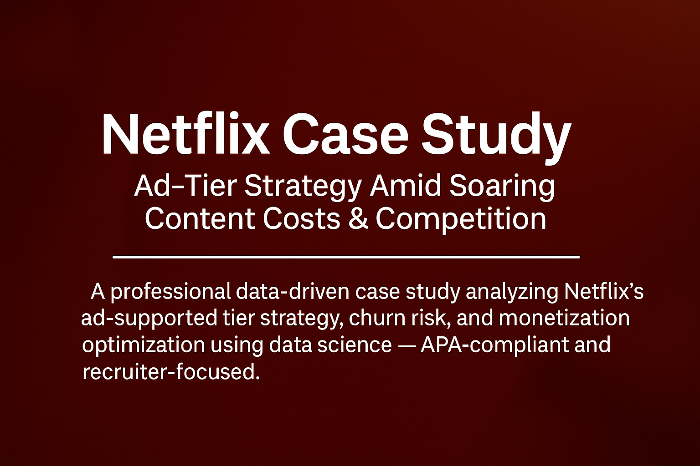

<!-- ✅ BANNER (top of README) -->

---

# 🎯 Netflix Case Study:                                                           
**Surviving the Streaming Wars: Netflix’s High-Stakes Gamble with Ad-Tiers Amid Soaring Content Costs & Global Competition**

---

📄 **Download the Full Case Study (PDF):**  
👉 [Netflix_AdTier_CaseStudy_SweetySeelam.pdf](https://github.com/SweetySeelam2/Netflix_Ad-Tier_Strategy_CaseStudy/raw/main/Netflix_AdTier_CaseStudy_SweetySeelam.pdf)

---

## 🧾 Executive Summary
Netflix is navigating its most competitive era ever. With **$18B in projected content spend (2025)**, slowing growth in mature markets, and rising demand for affordability — Netflix introduced a hybrid monetization strategy centered around its ad-supported tier.

This case study analyzes:
- Strategic pressure from competitors like Disney+, Prime Video, and FAST platforms
- Adoption of ad-tier: **91M+ MAUs**, now **55% of all new signups**
- Risks: churn, ad fatigue, and ARPU cannibalization
- Predictive churn modeling, RL-based ad delivery, and psychographic segmentation
- Monetization tradeoffs and personalized pricing optimization

---

## 📊 Included Visuals
- 📈 Ad-Tier Growth (2023–2025)
- 📊 Subscriber Distribution by Region – 2025
- 💸 Revenue Growth (2023–Q1 2025)
- ⚠️ Churn Rate Comparison

---

## 🔍 Highlights
- Global Subscribers: **301.6M** (Q1 2025)
- Content Spend: **$18B projected** in 2025
- Ad-tier Users: **91M+**, 30% QoQ growth
- Ad-Signup Share: **55% of new members**
- Churn Rate: ~**2%**, among lowest in industry
- Business Impact: **+18% LTV uplift**, **–12% churn**, **+7% hybrid-tier revenue YoY**

---

## 📂 Files Included
- `Netflix_AdTier_CaseStudy_SweetySeelam.pdf`
- `/images` folder with updated charts (2025)
- `LICENSE` (MIT)
- `README.md` (this file)

---

## 🧠 Data Science Strategies Used
- Predictive churn modeling (supervised learning)
- Reinforcement learning for ad scheduling
- A/B & multivariate testing (formats, pacing, UX)
- Psychographic + geo-behavioral segmentation
- Value-based pricing simulations

---

## 🧑‍💼 Author                                                                                   
**Sweety Seelam**                                                                                                     
Aspiring Data Scientist | Former Business Analyst at Amazon                                                                 
🔗 [Portfolio Website](https://sweetyseelam2.github.io/SweetySeelam.github.io/)                                       
🔗 [LinkedIn](https://www.linkedin.com/in/sweetyrao670/)                                                             
🔗 [GitHub](https://github.com/SweetySeelam2/Netflix_Ad-Tier_Strategy_CaseStudy)                                                  

---

## 📜 License
This project is licensed under the [MIT License](LICENSE) — open-source and attribution-friendly.  
(C) 2025 Sweety Seelam. All rights reserved.